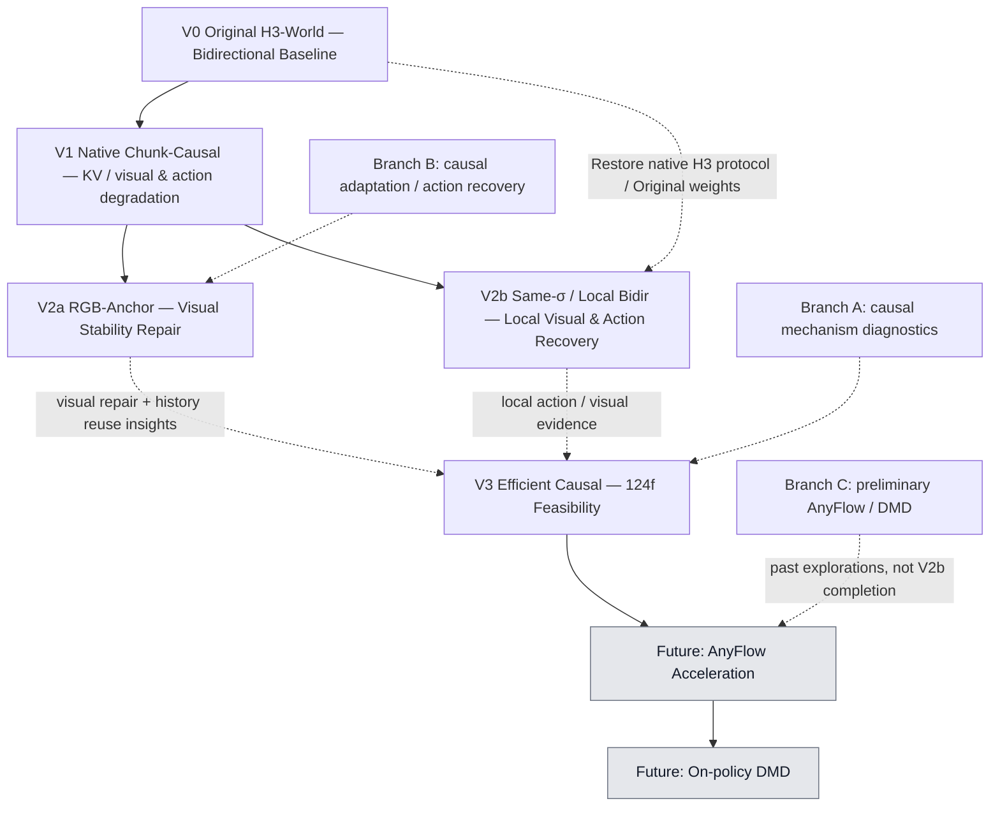

# 研究主线：V2a / V2b是并列探索，V3已完成有限可行性统一

V0建立原始能力，V1实现基本因果化并暴露动作/视觉退化。V2a和V2b都针对生成历史/条件协议与原生模型不匹配的问题，探索不同解法；**二者不是先后升级关系，也没有checkpoint继承关系**。

图中V1到两支表示研究问题的分叉；V0到V2b说明实际权重/协议来源。V2a与V2b之间没有继承箭头。指向V3的虚线表示研究经验；实际权重仍为Original + released action LoRA，EXP-002/003以同一配置验收。

| 维度 | V2a：RGB-Anchor Causal | V2b：Same-σ History / Local Bidir |
|---|---|---|
| 共同问题 | 因果rollout中生成历史/条件与原生模型行为不匹配 | 同一研究问题的另一条路线 |
| 核心思路 | 修复图像条件协议，配合视觉适配 | 恢复原生条件和尽可能接近原生的局部联合去噪 |
| 图像条件 | RGB-consistent dual anchor | Single I0 |
| 历史 | 自己生成的clean endpoint经clean commit写入KV | 自己生成的history按当前σ临时加噪，每步重算 |
| Attention | Strict chunk-causal video attention | 已可见history与当前video局部双向；未知未来移除 |
| Persistent hidden KV | 支持，CPU raw video K/V | 不支持 |
| 采样 | 8steps/chunk | 30steps/chunk |
| 新增训练 | visual QKV + endpoint/boundary/replay；使用已训action residual | 无；Original + released action LoRA |
| 视觉证据 | 124f人物/场景相对完整；20秒崩坏 | 持续A/D124f基本结构可用；有边界和节奏缺陷 |
| 动作证据 | A/D方向门槛失败 | 四路径第二块正结果；持续A/D延伸124f，DA第三块有疑点 |
| 主要不足 | 动作控制；更长时程也退化 | 历史重算成本、效率与长时可靠性未验证 |

## 证据范围必须分开

**V2a — Longer-horizon Visual Stability Demonstrated：仅指124帧的相对视觉证据。** A/D仍失败，同checkpoint20秒视频严重退化，不能说已经解决长期崩坏。RGB anchor、visual adapter、endpoint/boundary监督与routing共同变化，不能把全部提升只归因anchor。

**V2b — 持续A/D124帧可行性已验收，历史四路径正结果仍限56帧第二块。** 原生Single I0、native time、Same-σ和C12→5/T2联合协议在自身history下有效；新增持续A/D六块124f可行性结果，尚无跨场景结果，也不支持persistent hidden KV。

## V3可行性验收与后续范围

EXP-002/003已验证native Single I0/current-prefix/strict causal/真实KV配置到AA/AD124帧；同history第二块有可辨动作响应。AA约79–86帧明显人体形变后恢复，保留质量与连续性限制。没有新训练、成熟画质、跨场景或公平Original完整E2E加速结论。

下一阶段优先在冻结V3上验证有限预算的少步路线，不为局部缺陷无限加实验。AnyFlow/DMD仍是后续工作，历史preliminary探索不视为当前已完成。

[V3正式版本](V3_efficient_causal/README.md) · [下一步](02_next_steps/README.md) · [首页](README.md)
