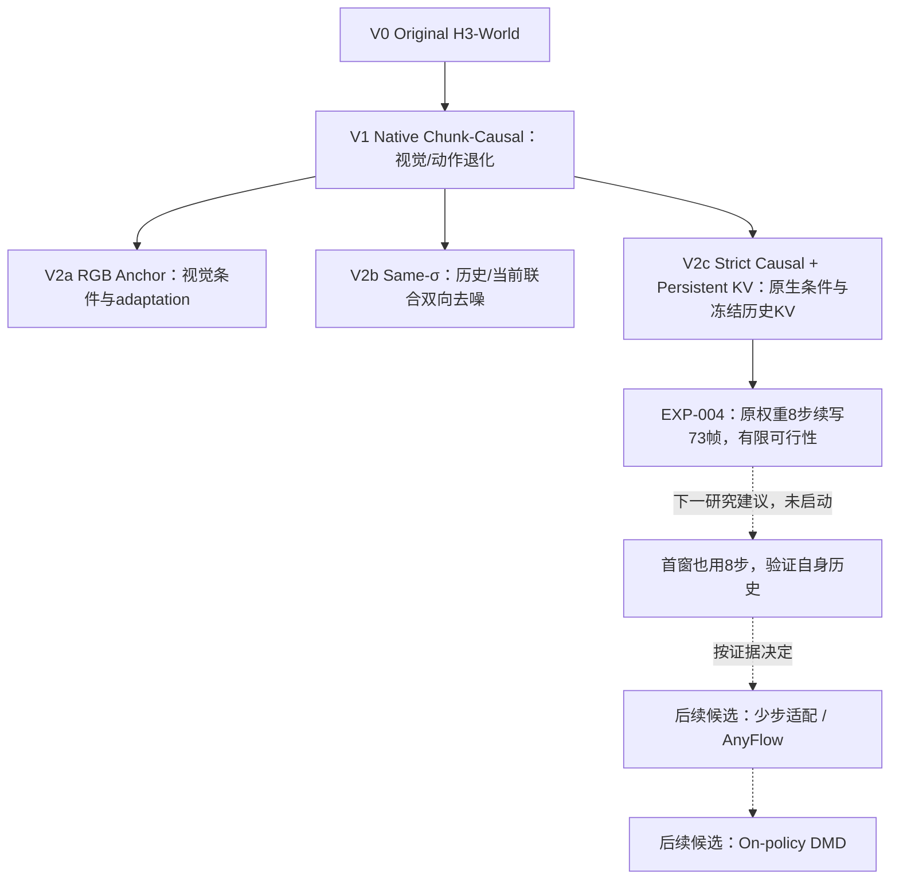

# 研究路线：V1之后的三条V2并行方案

V2a、V2b、V2c是针对V1视觉与动作退化的三条并行研究路线。字母标识方案，不表示V2a → V2b → V2c的权重继承。V2b和V2c使用Original H3 + released action LoRA；V2a有自己的视觉适配。

箭头表示研究问题和实验推进，不表示权重继承。V2c原名V3 Efficient Causal，本次按研究思想重新分类；未来V3定义尚未发布。AnyFlow/DMD历史探索和本轮普通FM减步需分别记录。

| 路线 | 研究思想 | 主要优势 / 已验证范围 | 主要限制 |
| --- | --- | --- | --- |
| V2a：RGB Anchor | 通过视觉条件一致性和 adaptation 维持画面 | 124帧基本人物/场景结构，支持严格因果与KV | 动作控制失败；20秒后段退化 |
| V2b：Same-σ | 保留可见历史与当前视频的联合双向去噪 | 持续A/D124帧动作与基本结构可用 | 计算昂贵，无persistent KV；切换和连续性有限 |
| V2c：Strict Causal + Persistent KV | 原生条件、current-prefix与冻结历史KV实现严格因果生成 | AA/AD124帧动作、结构与真实KV复用可行；另有8步续写73帧证据 | 瞬态人体形变、连续性PARTIAL；8步首窗仍借用30步 |

## 当前判断与下一步

EXP-002/003已验证V2c同一native Single I0/current-prefix/strict causal/真实KV配置的AA/AD124帧可行性。AA约RGB79–86有明显人体形变后恢复，画质和连续性仍PARTIAL。EXP-004只将新增块30步改8步，两条路径续到73帧，首39帧仍借用30步生成历史。

下一步优先验证从首窗也用8步，判断直接减步能否独立成立。按有限预算、可行性和ROI推进，不为小幅指标收益反复实验，不因失败自动扩大训练。

[V2三路线与视频](v2/README.md) · [下一步](02_next_steps/README.md) · [汇报首页](README.md)
