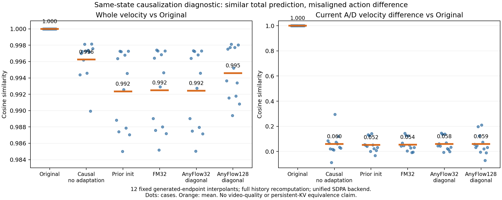

# 08：定位 AnyFlow 之前的动作几何失配

解决的是归因问题，尚未解决视频画质或动作控制。

此前不能区分action alignment错误、因果依赖图改变及AnyFlow训练的影响。固定同generated history/noisy chunk、仅替换当前A/D，先检查时间索引/直接attention路由/KV不变性；再统一输入token范围、RGB条件、sigma、SDPA后端，对照Original双向、原权重causal、匹配FM32与AnyFlow32。

Original权重仅换causal后，整体velocity cosine0.9963，动作差分cosine0.0602；旧FM32/AnyFlow32未修复。由此把下一步从盲增AnyFlow updates转为真实ABot causal FM桥接。完整历史重算诊断不等于部署persistent-KV；BF16后端误差对动作小差分敏感，两点均保留。

本次没有产生新的生成视频；已有会议对比不替换。[图与完整结果](RESULTS.md)、[当前A–D门槛](../../reports/stage1_anyflow/ABCD_STATUS.md)。

