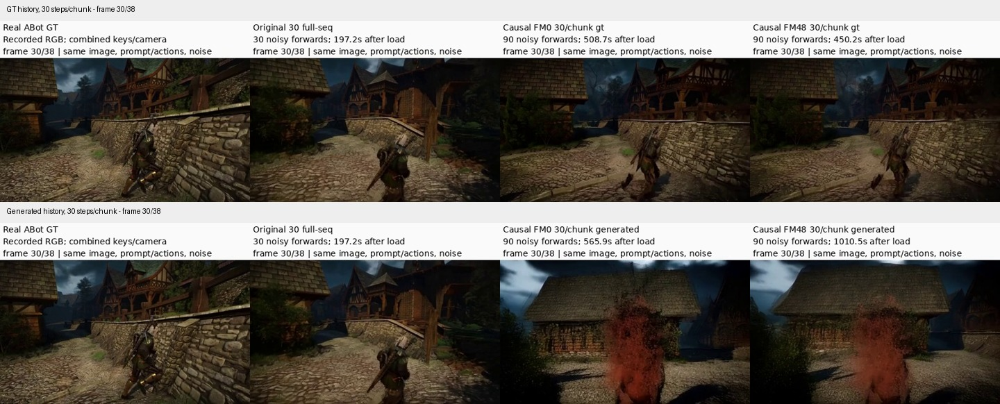

# 10月8日晚至10月9日早上的真实视频训练与诊断进展

**这些训练报告和完整对比视频已经同步到GitHub。昨晚不是只做了4次更新：先完成了两轮各48次更新的真实视频FM训练，后来E2才是两臂各4次更新。** 当前工程与机制证据更完整，但尚未通过动作＋人物结构联合验收。此页是会议补充，不替换旧124帧主Demo，不启动新实验。

这里“真实视频”指ABot数据集中实际录制的游戏视频及按键/相机记录，区别于Original H3生成的伪标签；不是现实世界相机实拍。

## 先展示这两条：同一场景，GT history与generated history

| 展示 | 完整视频 | 该看什么 |
|---|---|---|
| 真实数据训练后，GT history，30steps/chunk | [39帧四列对比](../reports/stage1_anyflow/real_abot_fm/report/trained_complete_gt30/dfec8ed3237860eba14d67c089ecd041_D_1750_comparison.mp4) | 人物大体保留，但有边界重置、环境漂移；FM48相对FM0无明确质变 |
| **同一场景、同一FM48 checkpoint，换成自己的generated history** | [39帧四列对比](../reports/stage1_anyflow/real_abot_fm/report/trained_complete_generated30/dfec8ed3237860eba14d67c089ecd041_D_1750_comparison.mp4) | 约23帧出现红色残影，26–35帧人物分解，末段几乎消失；训练没有修复 |
| 另一场景的generated history，避免只看最差例子 | [39帧四列对比](../reports/stage1_anyflow/real_abot_fm/report/trained_complete_generated30/118eb5d8b75e1b8ac23a4e9ae77af9a9_A_1140_comparison.mp4) | 人物仍在，运动减弱、环境形变仍在，不是所有场景都同样崩坏 |

四列从左到右均为：**真实ABot GT / Original H3 30整段steps / causal FM0 / causal FM48**。causal每块30步、3块，共90noisy forwards＋3commits，不是整片30次调用。GT-history为oracle条件诊断，不能说成自由rollout。自然场景保留联合键盘/相机控制，不能用不同场景的flow差声称纯A/D保真。

同一第30帧的预览（上GT-history，下generated-history；完整39帧见上方链接）：

这能直观展示generated-history风险，但不能证明所有失败都只因缺少Stage2，因为局部reference/GT条件下仍有结构问题。

## 昨晚到早上的四个关键进展

| 时间 | 做了什么 | 得到的结论 |
|---|---|---|
| 10月8日18:59–22:48 | **真实ABot普通causal FM，48更新**；16train/8validation，按episode隔离；Original＋released action LoRA初始化，rank8全block/refiner QKVO/FFN，GT clean history，全历史梯度 | 固定验证中/高噪声loss下降1.42%/5.11%；人物分解与A/D geometry没有恢复。训练完成不等于Stage1完成 |
| 10月8日23:47–10月9日02:57 | **第二轮48更新**；仅把训练sigma采样shift12→2.22，权重函数shift仍为12，其他设置匹配 | 低噪声覆盖由4/192增至30/192，但停车场A方向仍错、8步后段重影仍在；仅改变该采样分布没有解决问题 |
| 10月9日清晨，06:24完成 | **E1局部history条件诊断，零训练**：保留Original局部信息流，逐sigma重算；clean历史C对比同sigma加噪历史N | 两份停车场历史下，N均得到A正/D负；说明历史条件显著影响后续动作响应。但当前A仍有重影，联合gate失败 |
| 10月9日上午，后续收齐评审 | **E2观察动作后果监督**：FM-only / FM+action各4更新，只改变loss；两份停车场history＋两条真实GT-history | 动作项没有一致额外收益，冻结4更新；不是把昨晚48更新续训成52步，也不是AnyFlow或Stage2 |

真实视频48更新的训练wall约2.88小时，峰值allocated约29.42GiB。其训练和结果见[FM48完整验收](../reports/stage1_anyflow/real_abot_fm/FM48_COMPLETE_REVIEW.md)；采样分布对照见[最终结果](../reports/stage1_anyflow/fm_density_control/FINAL_RESULTS.md)。

## 最值得加播的机制进展：后续chunk的方向回来了，人物结构还没过

播放[固定A-history，C/N × 当前A/D](../reports/stage1_anyflow/history_conditioning/window1_A/CN_AD_context.mp4)。左列clean历史C，右列同sigma加噪历史N；上排当前A，下排当前D。前8帧是共同历史，后42帧是当前窗口，**不是50帧自由生成**。

| 固定history | 条件 | 当前A flow | 当前D flow |
|---|---|---:|---:|
| A-history | C clean历史 | +1.27562 | +1.17602 |
| A-history | **N同sigma历史** | **+1.64549** | **−1.54673** |
| D-history | C clean历史 | +0.30964 | −1.48260 |
| D-history | N同sigma历史 | +0.61410 | −0.67382 |

A-history下D从同向变为反向，是值得展示的局部改进；但A分支仍有人物残影，不能宣布action＋质量全部恢复。T2/N每sigma重算visible hidden，**没有persistent hidden KV复用**，这与主片旧KV路线不同，也不能直接拿历史2.023的整段teacher separation作同协议比较。[完整机制结果](../reports/stage1_anyflow/history_conditioning/VIDEO_RESULTS.md)。

## 最新真实GT-history训练对照：不要和昨晚FM48混淆

- [场景1：Original local N / FM-only4 / FM+action4](../reports/stage1_anyflow/real_transition_windows/review_step4/118eb5d8b75e1b8ac23a4e9ae77af9a9_D_1015_comparison.mp4)
- [场景2：Original local N / FM-only4 / FM+action4](../reports/stage1_anyflow/real_transition_windows/review_step4/dfec8ed3237860eba14d67c089ecd041_A_1080_comparison.mp4)

这里左列也是局部N，不是Original完整双向视频。两条都是39当前帧；联合按键及观测派生相机F条件保留，不是纯A/D实时交互测试。一个场景首边界背景拖影减少，另一个几乎不变；FM+action与FM-only没有一致差异。[最终E2报告](../reports/stage1_anyflow/real_transition_windows/FINAL_RESULTS.md)。

## GitHub同步范围

远端核查基准为`4460166`，上述报告和视频已经在远端main中，而不只是本机存在。三个训练归档目录分别有19/12/34个MP4文件（包括原始参考、单条结果和拼接对照，**不是65次独立实验**）。

**已同步：** 数据来源/划分manifest、脚本和冻结协议、训练与评测收据、loss/geometry/MAD/flow统计、帧图与完整对比视频。

**未上传：** 这三轮训练的新adapter张量、optimizer/RNG文件、encoded latents和原始数据集；这些仍在本机outputs。仓库`checkpoints/`目前主要是旧会议Demo/诊断adapter，不能当作新FM48/E2权重。此页列出的新视频是训练后实际生成并归档的结果，不需要这些权重即可播放。

最终checkpoint在本机的目录：

- `H3-World/outputs/2026-10-08-18/stage1_real_abot_fm/train_48/step_48/`
- `H3-World/outputs/2026-10-08-23/stage1_fm_density_control/train_48/step_48/`
- `H3-World/outputs/2026-10-09-06/stage1_real_transition_windows/train_fm_only/step_04/`
- `H3-World/outputs/2026-10-09-06/stage1_real_transition_windows/train_fm_action/step_04/`

[远端归档核查与本机checkpoint存在性记录](overnight_assets/sync_audit.json)。本轮仅整理展示，不追加训练、不替换124帧会议主视频。
