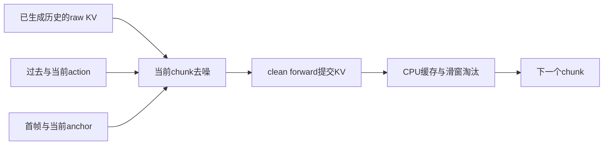

# 5分钟展示提纲（6页，含播放时间）

## 1｜结论先行与主片，0:00–0:35

播放[Original vs causal W124](annotated/h3world_rgb_stable_W_original_vs_causal_timed.mp4)。

- 真实H3因果分块和KV执行可行。
- 动作保真、长期画质、端到端加速尚未同时成立。
- 右侧：**2026-10-06 `visual_online_rgb_tail16_endpoint_ad2`**，普通FM/replay；不是最新AnyFlow/E2。

页脚：[checkpoint哈希与来源](DEMO_PROVENANCE.md)。

## 2｜信息流比加一个mask更重要，0:35–1:35

- 当前块内部交互，跨块只读过去；future action/video不可见。
- Cached/recompute一致性≠Original双向模型等价。
- 最新T2/N保留局部Original信息流，每sigma重算：A/D方向改善，人物仍重影；**不复用persistent hidden KV**。
- 定位：[h3_cached.py](../code/causal/h3_cached.py)、[local_topology.py](../code/causal/local_topology.py)。

## 3｜少步、KV和速度分别验收，1:35–2:15

| 项目 | Original主片 | causal主片 |
|---|---:|---:|
| RGB帧数 | 124 | 124 |
| noisy forwards | 30整段 | 8×8=64局部 |
| clean commit | 无跨chunk提交 | 8 |
| 历史单次端到端 s | 442–454 | 673–768 |
| CPU raw KV | 无跨chunk持久KV | 13.19GiB |

没有warmup重复均值；没有weight/KV/activation峰值分解；内部首块计时不是首帧播放延迟。当前没有整体加速。

Stage0.5：双向FM适配 → Stage1：因果TF-AnyFlow少步初始化 → Stage2：on-policy DMD/SGF。**主片没有AnyFlow。**

## 4｜完整失败片界定结论，2:15–3:15

播放[同checkpoint的20秒对照](long_horizon/original_vs_rgb_visual_W_20s_481f.mp4)，包含崩坏后段。

- 约10秒雾化，15秒后人物/场景难辨。
- 主片A/D：Original `+1.077/−1.602`，causal `−0.784/−1.007`，A方向未恢复。
- AnyFlow做过真实训练但质量gate未过；DMD-lite近似与后续DMD工程原语不是完整Stage2结果。

## 5｜E2：受控负结果，所以停止扩训，3:15–4:15

[局部三列A片](../reports/stage1_anyflow/real_transition_windows/review_step4/parking_historyD_currentA_comparison.mp4)。同初始化、同4更新，仅loss不同；完整评测两份reference history＋两条GT-history。

| 固定history的A−D | Original local N | FM-only4 | FM+action4 |
|---|---:|---:|---:|
| A-history | 3.192 | 3.053 | 3.055 |
| D-history | 1.288 | 1.367 | 1.274 |

动作项没有一致收益；当前A仍有重影；held-out正确FM改善<0.03%。左列是局部N，**不是**Original全长双向推理。GT含联合相机/观测F，不能当纯A/D实时控制。

**冻结4更新，不扩16，不重启AnyFlow/Stage2。** [完整证据](../reports/stage1_anyflow/real_transition_windows/FINAL_RESULTS.md)

## 6｜下一步研究选择与交付，4:15–5:00

可信局部causal30 → AnyFlow4/8 → on-policy Stage2。

- 优先可靠action后果/时序、局部信息流与prefix重算。
- 不要求先解决全部20秒漂移，但不能忽略GT/reference历史下局部崩坏。
- 交付包含主片＋失败片、可定位代码、依赖与checkpoint哈希、测量收据、干净环境验收。

[复现说明](../REPRODUCE.md) · [最终验收](../reports/final_acceptance/README.md)
