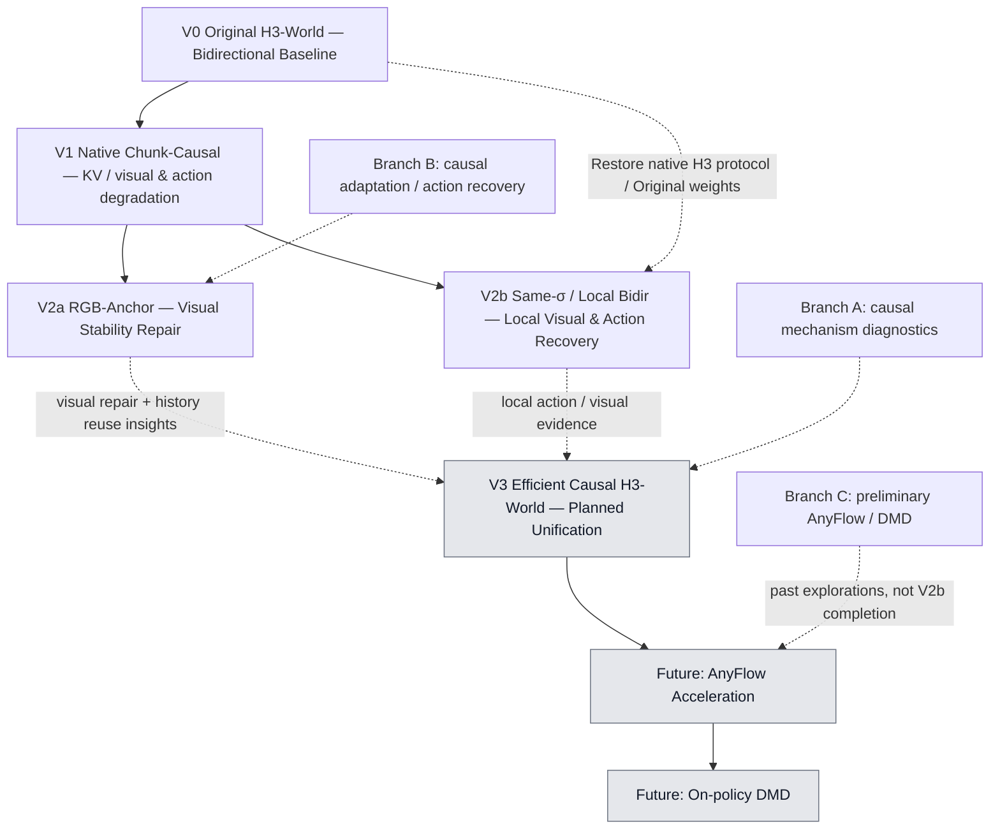

# 研究主线：V2a / V2b是并列探索，V3才是未来统一

V0建立原始能力，V1实现基本因果化并暴露动作/视觉退化。V2a和V2b都针对生成历史/条件协议与原生模型不匹配的问题，探索不同解法；**二者不是先后升级关系，也没有checkpoint继承关系**。

图中V1到两支表示研究问题的分叉；V0到V2b说明实际权重/协议来源。V2a与V2b之间没有继承箭头。向未来V3的虚线表示需要吸收的研究证据，不代表把两个checkpoint拼接就能成功。

| 维度 | V2a：RGB-Anchor Causal | V2b：Same-σ History / Local Bidir |
|---|---|---|
| 共同问题 | 因果rollout中生成历史/条件与原生模型行为不匹配 | 同一研究问题的另一条路线 |
| 核心思路 | 修复图像条件协议，配合视觉适配 | 恢复原生条件和尽可能接近原生的局部联合去噪 |
| 图像条件 | RGB-consistent dual anchor | Single I0 |
| 历史 | 自己生成的clean endpoint经clean commit写入KV | 自己生成的history按当前σ临时加噪，每步重算 |
| Attention | Strict chunk-causal video attention | 已可见history与当前video局部双向；未知未来移除 |
| Persistent hidden KV | 支持，CPU raw video K/V | 不支持 |
| 采样 | 8steps/chunk | 30steps/chunk |
| 新增训练 | visual QKV + endpoint/boundary/replay；使用已训action residual | 无；Original + released action LoRA |
| 视觉证据 | 124f人物/场景相对完整；20秒崩坏 | 56f中第二块人物结构基本完整 |
| 动作证据 | A/D方向门槛失败 | AA/AD/DA/DD第二块方向正确 |
| 主要不足 | 动作控制；更长时程也退化 | 历史重算成本、效率与长时可靠性未验证 |

## 证据范围必须分开

**V2a — Longer-horizon Visual Stability Demonstrated：仅指124帧的相对视觉证据。** A/D仍失败，同checkpoint20秒视频严重退化，不能说已经解决长期崩坏。RGB anchor、visual adapter、endpoint/boundary监督与routing共同变化，不能把全部提升只归因anchor。

**V2b — Local Visual and Action Fidelity Demonstrated：仅指56帧中的第二块。** 原生Single I0、native time、Same-σ和C12→5/T2联合协议在自身history下有效；没有第三/第四块、124f或跨场景结果，也不支持persistent hidden KV。

## 未来V3：需要训练/设计一个可信的严格因果骨干

目标为 **Efficient Causal Generation + Visual Stability + Action Fidelity**。研究上希望吸收V2a的历史复用和视觉修复经验，以及V2b的局部动作/结构能力；但当前没有证据证明简单合并anchor、adapter或checkpoint即可实现。

真正缺少的是：在**不依赖history与current video双向重算**时，仍有正确动作条件能力的causal模型。应先验证strict causal30的局部动作与结构，再评估persistent KV与长时生成；之后AnyFlow学习少步，on-policy DMD处理自身rollout分布。

此前AnyFlow/DMD是旁路先行探索，不是V2a/V2b已经完成相应阶段。[两支能力对比](00_comparison_gallery/V2a_vs_V2b.mp4) · [下一步验收](02_next_steps/README.md) · [首页](README.md)
