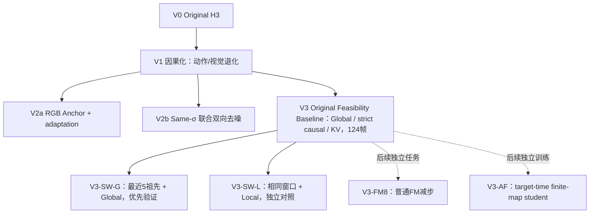

# 研究路线：冻结V3 Baseline，再验证Sliding Window

箭头表示研究关系，不表示V2a→V2b→V3的权重继承。V3-SW-G/SW-L当前为CPU阶段，尚未进行GPU生成验收；Baseline的124帧证据继续保留。Local raw KV位置重映射不等价重算所有历史；也不预设Local优于Global。

[V3三个协议](v3/README.md) · [V2修复方案](v2/README.md) · [CPU与分阶段任务](../experiments/EXP-005_v3_sliding_window/README.md)
