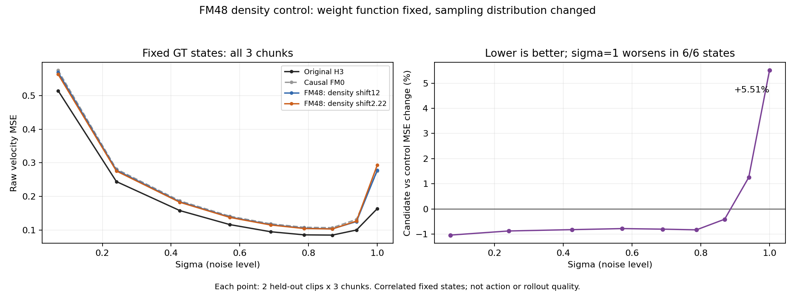

# 密度对照的54点结果：低/中噪声略好，纯噪声起点更差

2026-10-09 01:53。GPU0噪声扫描完整结束，原评测控制器已接续GT状态A/D探针。没有新增训练。固定54状态逐输入hash及Original完整输出逐点一致，所有模型各自构建只读GT history KV。提交包使用三份归档原始probe重算匹配和CSV，结果相同；见[重算收据](archive_replay.json)。

| noise段 | 点数 | Original | FM0 | FM48 shift12 | FM48 shift2.22 | 相对旧FM48 | 改善点数 |
|---|---:|---:|---:|---:|---:|---:|---:|
| low | 12 | 0.379522 | 0.428308 | 0.423719 | 0.419544 | -0.99% | 12/12 |
| mid | 18 | 0.122787 | 0.148706 | 0.146045 | 0.144871 | -0.80% | 18/18 |
| high | 24 | 0.108357 | 0.155600 | 0.152816 | 0.156710 | +2.55% | 15/24 |
| all | 54 | 0.173426 | 0.213904 | 0.210760 | 0.211171 | +0.20% | 45/54 |

low为sigma≤0.240781，mid为(0.240781,0.689441]，high为(0.689441,1]。不同段点数不同，all是本扫描的等权均值，不是训练/自然数据分布期望。两片段×三chunk是相关状态，不作为54个独立统计样本。

**sigma=1单独看：Original0.163484，FM0 0.276204，旧FM48 0.277907，新FM48 0.293210。新相对旧增加5.51%，6/6状态都变差。** sigma0.939540也在均值上增加1.25%；其余七个sigma的6/6状态均改善约0.4–1.04%。因此45/54点更好仍可以伴随整体均值略差，不能只报改善点数。

本受控结果暂不支持“降低采样shift即可单独修复causal field”的主张。它确实改善了被增加采样的低/中段，但纯噪声起点的causal额外误差扩大。没有改变loss weight函数，也不能把相同weight函数说成相同梯度分布。

测量为真实GT clean-history下的自然联合动作，不是A/D反事实或自由rollout。由z−sigma*v得到的单次endpoint MSE等于sigma²×velocity MSE，不能当作独立视频质量指标；本报告没有声称这些误差变化直接导致某种视觉结果。当前A/D geometry和generated-history30/8视频继续由原队列测量，完整B/C/D未验收。

[分sigma表](README.md) · [逐状态CSV](metrics.csv) · [图PNG](noise_density.png) · [图SVG](noise_density.svg) · [绘图源码](plot_noise.py)

