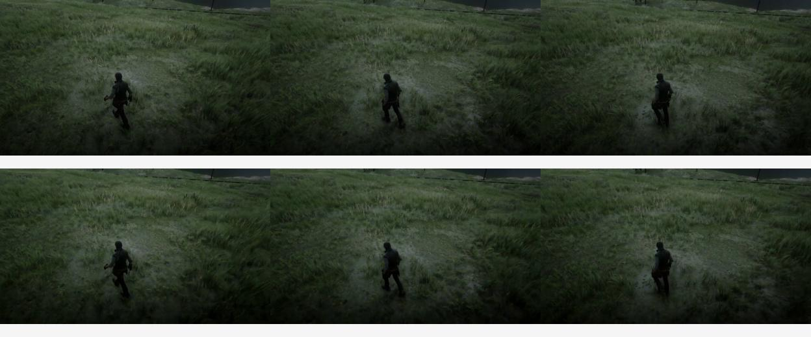
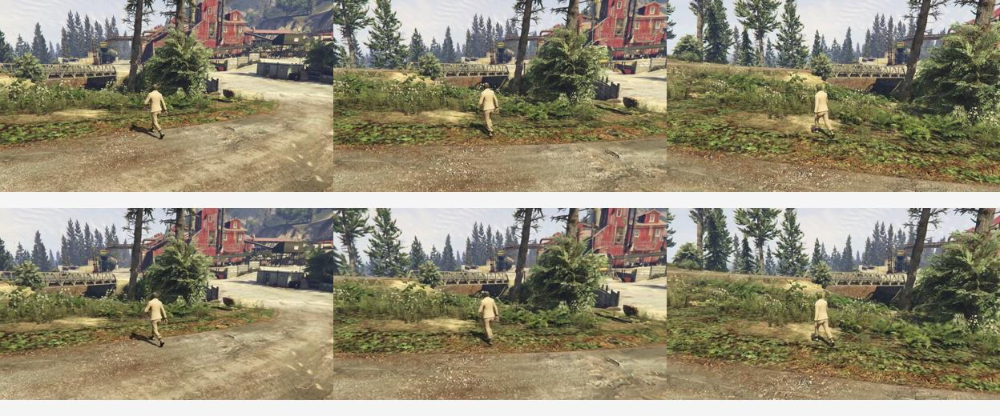

# 实验 B：真实 ABot 视频的 causal FM 桥接

最新23:35：FM48有限桥接的画质/action验收仍FAIL；新增[同状态noise扫描](../../02_causal_diagnostics/fm_noise_audit/INTERPRETATION.md)已完整，输入和Original输出哈希逐点一致。整体velocity MSE小幅下降没有恢复动作geometry，不直接采用低noise upweight。未新增训练；下方时间线为历史记录。

最新22:50：[FM48完整验收](FM48_COMPLETE_REVIEW.md)。全部10条视频和36状态几何已完成，画质/action未通过；全部队列退出。下方保留历史时间线。

数据准备、24 个片段的 VAE/条件编码、最终输入校验均已完成。**48-update 真实33B FM训练于2026-10-08 18:59在GPU0启动，尚未完成视频验收。** CPU小模型三chunk训练通过仅代表接口可运行。

- 数据来自 [ABot-World-Explorer-500h](https://huggingface.co/datasets/acvlab/ABot-World-Explorer-500h)，6个episode、16train/8validation；按episode隔离。
- 每段39帧、832×480、24fps；原30fps到24fps的视频选择与动作索引使用同一列表。每个episode选2个A-dominant与2个D-dominant窗口，保留真实联合按键与camera操作，不能冒充纯A/D。
- 真实 temporal VAE clean latent 形状 `[1,24,12,30,52]`。GT prefix decode→最后RGB→H3 image encode形成dual anchors；对应生成阶段同一种RGB条件路径。
- 初始化为Original H3+发布action LoRA，不继承旧训练visual/action residual。rank8全block/refiner QKVO/FFN bank、普通noise-minus-clean FM、GT clean history、全历史梯度、CPU raw KV。
- 48updates覆盖16cases×3chunks；logical batch4、LR3e-5、training shift12，固定验证shift2.22。没有AnyFlow、没有Stage2。

[完整A–D门槛](../../07_protocols/overviews/ABCD_STATUS.md) · [数据来源与截取收据](preparation.json) · [全部编码记录](encoding.json) · [最终输入校验](final_input_audit.json) · [启动参数](launch.json)

上排真实RGB、下排VAE重建的固定0/19/38帧仅用于预处理检查，不是模型生成结果：

归档保留来源、hash、脚本与小型收据，不含原视频数据集、encoded tensors、33B权重或optimizer。源runner依赖本机outputs运行快照；训练入口和real-data loader随本报告保存，不覆写此前已冻结的训练runtime。

数据集原发布文件：[说明](ABOT_SOURCE_README.md)、[Apache-2.0许可](ABOT_LICENSE)。所示RGB/VAE检查来自该公开数据子集；不声称真实世界实拍。两张重建PSNR分别为训练35.97dB、验证23.28dB。

评测入口前两次在首个denoiser输出前因prefix/text dtype失败，已分别保留源目录failed_evaluation_prefix_dtype、failed_evaluation_text_dtype。最终路径保持video/audio/anchor FP32、text BF16，与已有chunk_forward一致；[小H3混合精度检查](evaluation_dtype_preflight.json)通过。修正未改训练runtime/训练样本/噪声。Original30与step00的GT/generated基准已于GPU5串行运行；现已完成全部六条零更新基线，最新结果见下方完整评审。

首条Original30真实验证参考已完成，[静态全帧检查与指标](INITIAL_REFERENCE_REVIEW.md)、[完整39帧视频](original_reference_first/video.mp4)、[对应GT帧图](original_reference_first/gt_comparison.jpg)。人物/场景保持连续；这只是Original参考，不是causal结果。

## 2026-10-08 20:15 完整零更新基线与主代码集成

48-update训练目前20/48，仍未完成；本节所有causal视频为step00。

- [完整基线评审：第二场景30步人物分解](BASELINE_COMPLETE_REVIEW.md)
- [GT-history完整对比](report/baseline_complete_gt30/README.md) / [generated-history完整对比](report/baseline_complete_generated30/README.md)
- [18点同GT状态动作差分](geometry/step_00_gt/RESULTS.md)：delta cosine均值0.017516，无历史首块亦失配。
- Original新图纯[A视频](pure_action/original30/A/video.mp4)、[D视频](pure_action/original30/D/video.mp4)及[对应帧](pure_action/original30/AD_matched.jpg)：A−D仅0.033192；弱正控保留，不能将其套用停车场门槛。
- 主代码已接通`--real-data-manifest`，与teacher/smoke互斥，验证episode隔离/源哈希/动作时间bin，manifest hash绑定精确resume。`submission/code/causal/train_stage1_anyflow.py`与`real_video_data.py`为当前可维护入口；本报告顶层同名文件是实际运行的冻结快照。两者仅有训练metadata文字差异，运行snapshot未修改。
- 六项数据完整性/隔离/时间bin测试、[主入口CPU3步记录](root_cpu_integration3/training.json)、[旧checkpoint兼容](legacy_resume_compatibility.json)、[306项runtime保持检查](integration_archive_audit.json)。小模型检查不能替代真实画质。

诊断脚本依赖本机实验目录的runtime与encoded缓存，归档提供源码和输入哈希以供审阅；不把删除大权重/数据后的提交包声称为脱离依赖即可运行的自包含训练。真实训练命令见launch.json，先按数据准备/编码脚本重建manifest，并使用当前根目录实际路径。

[Attention路由差异解释](ATTENTION_ROUTE_INTERPRETATION.md)：当前动作双向直接入口仍在，但通用prefix反馈、过去action可见性、历史动作表示重算规则与Original不同。六布局CPU记录不是新增真实模型效果证据。

[归档视频完整解码检查](baseline_archive_video_validation.json)：4个三列基线对比＋2个纯Original A/D，均H264/yuv420p、24fps、39帧、faststart。

## 2026-10-08 20:29 固定generated-state诊断完成

[36点完整机制报告](GEOMETRY_BASELINE_RESULTS.md)：GT delta cos=0.017516，generated delta cos=0.012540；历史KV/参数不变、重复前向误差0。真实FM目前23/48，尚未得到trained视频；项目当前GPU0/4，后续评测最多0/4/1，控制器2136435等待训练正常退出。

## 2026-10-08 21:00 停车场baseline完成，FM 32/48

[完整三列视频与结论](report/parking_baseline_complete/README.md)：Original2.023377、causal0的30/8步−0.008565/0.010510，8步后段重影，30步画面改善但动作未恢复。[step32 checkpoint完整性](checkpoint32_integrity.json)已核查；训练后结果仍待生成。

[C/D官方方法与CPU梯度准备](../../06_stage2_preparation/cd_method_audit/README.md)独立归档，不改本次训练runtime或预算，也不计为H3 Stage2完成。

## 2026-10-08 21:28 FM 40/48与匹配评测准备

训练仍活跃，预算48不变；另一个GPU1只读首块消融已结束，见[解释](../../02_causal_diagnostics/first_chunk_routes/INTERPRETATION.md)。不将它当成训练后效果。新增[逐状态比较器](compare_geometry.py)和[CPU验证](geometry_comparator_validation.json)，待step48两套固定states全部完成后运行；不接受own-generated作为匹配前后输入。

## 2026-10-08 22:01 48更新完成，效果验收进行中

[训练审计与分噪声loss](FM48_TRAINING_RESULTS.md)：48更新正常完成，中/高噪声raw loss下降1.42%/5.11%，低噪声validation未覆盖。三路GPU评测已启动，尚无完整训练后视频/action结论；[CPU报告队列](post48_reports.json)等待各组完成后自动整理，不自动判PASS。

## 2026-10-08 22:06 第一条训练后GT-history完成

[完整视频及静态全39帧检查](review/first_trained_gt30/README.md)：人物可辨，训练前这条GT历史也如此；场景漂移和边界重置仍在，未见明确质变。联合动作水平flow0.8856→0.5612，不据此判纯A/D成功或失败。完整B评测继续。
