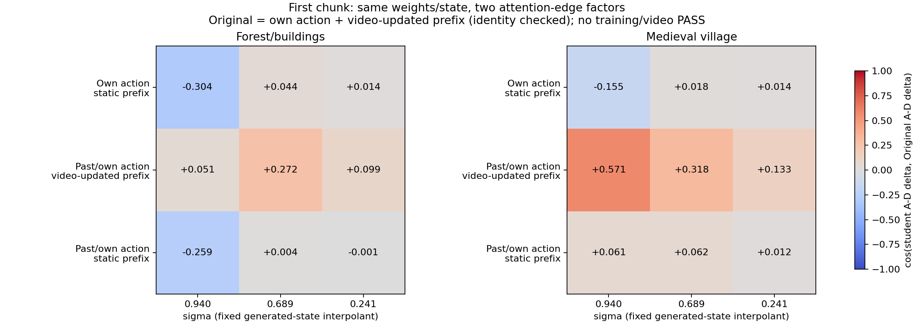

# 首块的两类 attention 边：固定权重与状态的 2×2 消融

本实验隔离“当前动作行已经对齐，但差分方向仍失配”的结构因素。两个验证场景的固定step00生成endpoint，各取高/中/低三个sigma，只比较首个5-latent块，因此没有历史KV。所有分支用相同Original权重、发布action LoRA、token范围、anchor、时间、A/D pair和SDPA调用方式。

| 视频读取动作的规则 | 通用prefix能否读取当前视频 | 整体velocity cos | A/D delta cos | delta cos范围 |
|---|---|---:|---:|---:|
| 仅自己绑定动作 | 允许 | 1.000000 | 1.000000 | 1.000000～1.000000 |
| 仅自己绑定动作 | 禁止 | 0.991841 | -0.061621 | -0.304254～0.043747 |
| 过去及自己绑定动作 | 允许 | 0.999107 | 0.240543 | 0.051224～0.570943 |
| 过去及自己绑定动作 | 禁止 | 0.991830 | -0.019933 | -0.258759～0.062315 |

当前动作自身的action→video反馈在四个分支全部保留。这里的“通用prefix”是非action的图像/场景文本/音频等行，不能混同于当前action反馈开关。

“仅自己动作＋允许prefix读取视频”的首块mask与Original逐元素相同；两个场景中sigma的独立Original重放A/D共四次RMSE均为0。因此该行的cos=1是身份正控，不是新模型取得恢复。两个单边改动和现行causal分支的效应见完整逐状态CSV；不能把余弦差当成可相加的归因比例。

CPU以真实layout核查四种mask只改变两类声明的边，且attention图的50层可达性中未来chunk的action内容不能流入当前video。这不是多chunk泄漏验收，text-refiner等其它路径的语义仍沿用已核查的输入协议。

另在两个中sigma状态，把现行causal的完整prefix SDPA与部署split-query cached路径对照；空cache保持零commit/零字节，结果单列在analysis.json，避免混淆mask差异和执行形状的数值影响。

**限制：** 这不是新训练、不是完整rollout，也没有证明单独修改某条边就能修好39/124帧视频。历史KV交互未在本实验中测试，首块以外不能直接推广。两项路由一起恢复到Original的首块身份正控，也不能当作完整causal方案。普通FM48训练与其评测协议保持不变。

[逐状态指标](metrics.csv) · [全部原始前向记录](probe.json) · [执行与identity控制](analysis.json) · [CPU mask检查](preflight.json)

执行：56次真实H3预测/重复前向，0 optimizer updates，404.54s，GPU allocated peak 20222.03MiB。这是诊断成本，不是视频推理benchmark。
