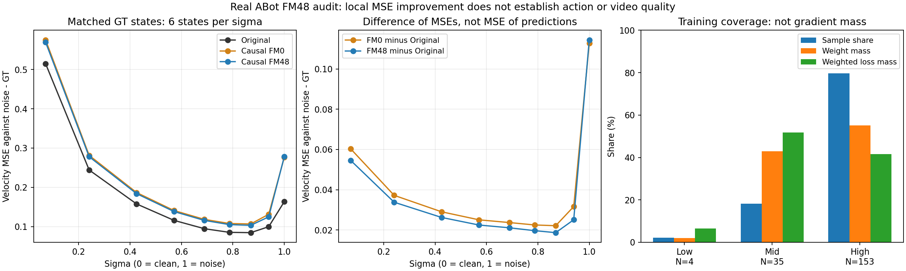

# 真实ABot FM：固定状态的噪声覆盖审计

两checkpoint各54状态已完成；零optimizer、无新增视频。Original / causal0 / causal48比较使用相同GT历史、自然联合动作、输入noise与anchor。它补充局部监督误差证据，不能替代A/D机制或视频验收。

- [结论与后续受控因素](INTERPRETATION.md)
- [逐sigma结果](RESULTS.md)、[逐状态CSV](metrics.csv)、[完整统计](analysis.json)
- [进程、源哈希与完成收据审计](completion_audit.json)
- [训练样本覆盖](training_coverage.json)
- [原始step00](step_00/probe.json)、[原始step48](step_48/probe.json)



`probe_noise.py`是GPU运行时冻结的源文件，依赖原项目的B runtime、已编码真实ABot数据和checkpoint，不是脱离权重/数据即可运行的提交包命令。启动环境与源位置保存在`launch.json`。实际运行：GPU0/1，2026-10-08 23:04启动，各约20分钟；扫描前后无新增训练。

统计可从本目录收据重算，无需GPU或模型：

```bash
python report_noise.py
python plot_noise.py  # 仅此绘图命令需要matplotlib
```

在submission中，统计脚本读取相邻`real_abot_fm/training_snapshot.json`，其sha256与实际训练的`train_48/training.json`一致。原始扫描源未改动；统计脚本仅在完成后增加提交包路径fallback。`analysis.json`的重算时间可变化，状态数据、分组数值和CSV应相同。

端点MSE来自单次`z_t-sigma*v`，代数上等于`sigma² * velocity MSE`。不能解释成完整采样终点质量。CPU KV只保留10个历史latent的统计不能与完整12latent最终缓存混用。
