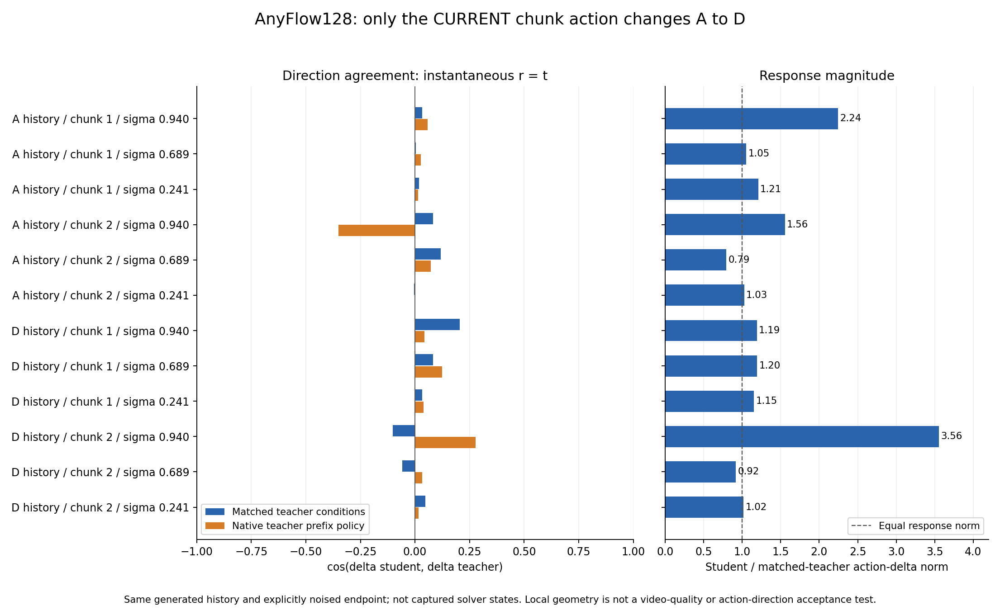

# 同状态 A/D 干预：动作能改变输出，但速度差分方向没有保留下来

**12 个真实 33B 检查点全部完成。结果支持优先调查因果化后的动作条件函数/velocity geometry；本次没有发现当前 A/D 实验存在 action row 错位、当前动作直接路由缺失、未来动作内容泄漏或反事实分支污染历史 KV。**

本次使用 AnyFlow128，不是未通过的136候选。固定它的两条39帧自生成轨迹，在后两个chunk和三个sigma上，保持同一history及显式加噪状态，只替换当前chunk动作。主对照为 student `r=t` 与Original H3瞬时velocity；有限区间输出另存，避免混淆预测对象。

## 结果

下表为匹配dual RGB anchors、prefix时间和全局位置的Original H3权重参照。Chunk从0计数。

| 固定历史来源 | 当前chunk | 高噪声 .939540 | 中噪声 .689441 | 低噪声 .240781 |
|---|---:|---:|---:|---:|
| A rollout | 1 | 0.0325 | 0.0036 | 0.0190 |
| A rollout | 2 | 0.0836 | 0.1188 | −0.0055 |
| D rollout | 1 | 0.2050 | 0.0830 | 0.0319 |
| D rollout | 2 | −0.1023 | −0.0588 | 0.0479 |

数值是 `cos(Δv_student, Δv_teacher)`。12点等权平均为 **0.0382**，范围 **−0.1023到0.2050**；不同点并非全部为零。Student/teacher差分范数比为 **0.7935–3.5563**，所以这些状态上动作干预有非零响应，但其变化方向与teacher弱相关。

保留原始单anchor/native prefix时间的第二组teacher参照，平均余弦 **0.0297**，范围 **−0.3501到0.2774**。部分点对teacher条件敏感，两套结果完整并列；没有挑选更好或更差的一套作为唯一证据。12点来自同一seed/场景，不是独立统计样本。

[完整12点、逐路径和资源表](RESULTS.md) · [原始CSV](metrics.csv) · [分析JSON](analysis.json)

## 对齐、路由和缓存检查

1. 当前动作span：latent5–9对应RGB[17,34)，latent10–11对应RGB[34,39)；静态prompt和过去/未来action rows不变。当前视频global RoPE和末帧anchor位置逐张量核对。
2. 实际attention：读取进入SDPA的mask，在第0/25/49层检查video直接看past/current action、当前/历史video可见、action feedback只读所属当前帧，prefix不读取历史KV。符合当前`causal + feedback`设计；不等于与Original的直接own-action路由相同。
3. 历史KV：只用原始A或D历史动作进行clean commit；同状态A/D分支只读。4组history的完整KV内容hash和commit次数全部保持不变，模型参数version不变。
4. 数值对照：4次student重复、4次teacher重复前向的RMSE全部为 **0**；两种history下只改future chunk动作内容的当前输出RMSE也均为 **0**。这检查固定layout的内容泄漏，不是任意变长action文本的完整时间契约证明。

还分别改变文本动作与learned residual控制输入，组成中sigma的2×2干预。单独文本路径的teacher-delta余弦范围约 **−0.100到0.080**。现有结果不支持“文本路径已保留正确teacher几何，只被residual抵消”的解释；也不能把一个latent方向指标等同于视频中的左右方向。

## 可以得出什么，仍不能区分什么

**当前证据将问题定位到动作条件生成函数没有迁移好，继续泛称‘缺一次action alignment’缺乏依据。** 这里的action geometry指改变动作引起的latent velocity变化方向，不是新增视频质量指标。

需要保留架构差异：teacher在同一原始history latent上双向重算隐藏状态，当前动作能先影响当前video，再影响历史隐藏状态，最终反馈到当前输出；student历史KV固定，设计上删除了这个依赖路径。即使两边原始history/noisy latent完全相同，内部历史表征也不相同。因此低余弦**不能唯一归因于训练权重错误**，也不能仅凭它排除generated-history分布偏移。

此外，当前状态是`(1-sigma)*saved_generated_endpoint + sigma*saved_initial_noise`，不是当时solver实际经过的状态；teacher是同prefix的retake诊断，不是完整39帧常规推理。固定history、同噪声和当前动作干预要求满足，但结论限定于这些受控状态。两组teacher都保留released H3-World action LoRA，只关闭我们新增的适配。

## 下一项建议：先拆分结构与训练影响

本轮已完成，不追加训练。下一项最有辨识力的只读消融是固定这些输入，对照：

- Original权重＋原始双向attention；
- Original权重＋当前causal/KV路由；
- 训练后的AnyFlow128＋当前causal/KV路由，使用`r=t`。

每种模型从相同原始history重建**自己的KV**，再在该固定KV上做当前A/D反事实；不可把student KV直接交给Original权重，造成混合模型历史。

若第二项已失配，优先调查causal路由/缓存改变依赖图后的适配缺口；若第二项保留而第三项失配，再定位训练适配。该三路消融尚未运行。没有启动更多LoRA、anchor扫参或Stage2；当前Stage1视频效果仍未通过，不替换会议Demo。

## 执行记录

单GPU6串行两条history，每条57次noisy diagnostic forwards＋2次clean history commits；分别473.87秒、421.92秒。峰值allocated为28763.39/27626.28MiB，CPU KV峰值5403.44MiB（最多缓存10个history latent，所以不同于完整12latent rollout最终缓存）。使用CPU权重offload，这些耗时不能用于生成speedup结论。

复现脚本与冻结输入哈希见本目录；原始执行目录为`H3-World/outputs/2026-10-08-17/stage1_generated_action_geometry/`。CPU小H3的teacher/student精确恢复检查、真实layout审计均通过。没有优化器更新，没有新视频生成。
