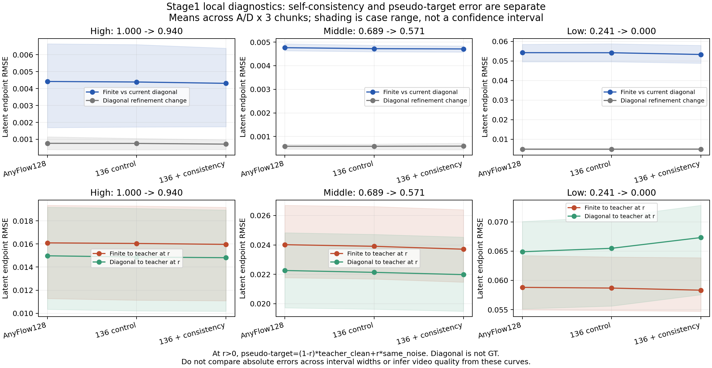

# 128/136双局部指标：诊断完成

同clean history/teacher-noise插值状态，A/D×3chunks。高/中/低是三个固定噪声锚点，不是整个噪声段的期望值。正常finite-map4/8完整视频另行验收。

| checkpoint | 噪声锚点 | cases /6 | finite/当前diagonal相对速度RMSE | finite/diagonal端点RMSE | finite到teacher(r) RMSE | diagonal到teacher(r) RMSE | finite(t→0)到clean RMSE |
|---|---|---:|---:|---:|---:|---:|---:|
| initial128 | high | 6 | 5.37% | 0.004419 | 0.016098 | 0.014977 | 0.643166 |
| initial128 | middle | 6 | 2.93% | 0.004762 | 0.024014 | 0.022259 | 0.219518 |
| initial128 | low | 6 | 18.12% | 0.054262 | 0.058802 | 0.064893 | 0.058802 |
| control136 | high | 6 | 5.34% | 0.004389 | 0.016046 | 0.014871 | 0.635398 |
| control136 | middle | 6 | 2.91% | 0.004721 | 0.023905 | 0.022133 | 0.217169 |
| control136 | low | 6 | 18.13% | 0.054226 | 0.058682 | 0.065483 | 0.058682 |
| auxiliary136 | high | 6 | 5.25% | 0.004310 | 0.015966 | 0.014812 | 0.638730 |
| auxiliary136 | middle | 6 | 2.91% | 0.004709 | 0.023707 | 0.021979 | 0.214912 |
| auxiliary136 | low | 6 | 17.90% | 0.053334 | 0.058319 | 0.067320 | 0.058319 |

每个case原值见metrics.csv/analysis.json。末区间额外记录到冻结128训练target的距离，不能替代当前模型self-consistency。高/中区间用4/8细分，末区间用8/16，参考细分误差单列。

r>0时teacher(r)=(1-r)×clean+r×同noise；不能把带噪端点直接和clean比较。另列的t→0是独立端点诊断；高/中t→0不是实际8步推理的单步。Original teacher仅伪GT，内部误差不能冒充视频质量。

比较同噪声锚点、同action/chunk的128/control136/auxiliary136，以分辨更自洽是否伴随伪目标距离恶化。不得将跨区间宽度的数值混成统一画质分数。

训练覆盖按(0,.240781]、(.240781,.425287]、(.425287,.689441]、(.689441,1]和diffusion/endpoint/map分开记录在analysis.json。固定8个辅助低噪声参考不等于随机低噪声训练分布已补齐。

## 本轮解释

低噪声当前自一致性相对速度RMSE：128为18.12%，control136为18.13%，auxiliary136为17.90%；auxiliary只比128下降约0.22个百分点。端点self-consistency RMSE为0.054262→0.053334。

finite到Original teacher clean伪GT的平均RMSE为0.058802→0.058319，约下降0.82%；6个case中5个略降，D/chunk1略升。**平均值没有支持“一致性改善是以finite伪目标正确性变差为代价”**，但改善很小，不能据此接受视频。

另一个容易混淆的数：到冻结128训练参考的velocity RMSE为0.225360→0.210929（约下降6.4%），明显大于当前模型自一致性的相对改善。同时当前diagonal16到teacher的误差从0.064893升至0.067320。说明frozen-reference fit与current self-consistency不是同一个测量，diagonal也不是GT。

真实正常finite-map4/8生成视频必须独立验收。当前8步辅助A/D仍重影且分离度0.635174，没有恢复原128的0.759660；不能把局部数值的小幅改善当作画质修复。完整4/8视频见[136结果](../interval_consistency_candidate/FINAL_RESULTS.md)。

所有54个case已完成，6个进程各159 noisy+3 clean；全部参数version及KV内容/commit数量不变，128重复输入/finite/diagonal输出hash与先前结果一致。共享主机只读探针不是速度benchmark。

