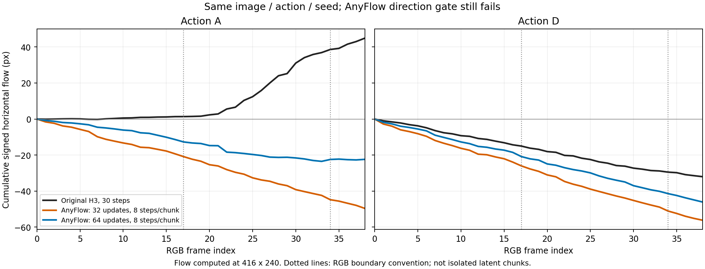

# 64次动作变化的时间分布：反向运动减弱，但尚未恢复方向

记录：2026-10-08T13:36:58.861070+08:00。复用现有Farneback和原先17/34 RGB边界，未增加action classifier或改变gate。

shift12的8-step A−D增加并非只来自末尾：首段和中段也有变化。但A在前两段仍为负；最后4个transition的A仅+0.015，不能以它代替整片的方向验收。

| model/action | full39 mean | [0,17) | [17,34) | [34,39) |
|---|---:|---:|---:|---:|
| Original / A | +1.181253 | +0.083398 | +2.220752 | +1.570233 |
| Original / D | -0.842124 | -0.894451 | -0.863608 | -0.630615 |
| AF_shift12_16 / A | -1.312275 | -1.219649 | -1.365800 | -1.122031 |
| AF_shift12_16 / D | -1.492164 | -1.506144 | -1.463643 | -1.228555 |
| AF_shift12_32 / A | -1.305473 | -1.205984 | -1.345781 | -1.205748 |
| AF_shift12_32 / D | -1.478164 | -1.494039 | -1.429047 | -1.274034 |
| AF_shift12_64 / A | -0.589203 | -0.710155 | -0.673391 | +0.015203 |
| AF_shift12_64 / D | -1.212299 | -1.157091 | -1.205778 | -1.166109 |
| AF_shift2.22_64 / A | -1.072072 | -0.891065 | -1.120918 | -1.317824 |
| AF_shift2.22_64 / D | -1.287603 | -1.317995 | -1.241826 | -0.892873 |
| FM_shift12_32 / A | -0.943292 | -0.882645 | -0.919771 | -1.306946 |
| FM_shift12_32 / D | -1.356802 | -1.404145 | -1.170357 | -1.501578 |

shift12 A−D分段（32→64）：
- 首段：0.288056 → 0.446936。
- 中段：0.083266 → 0.532387。
- 末段：0.068286 → 1.181313。

原始A在三个时间段均为正（首段很小），而AF64前两段仍为负。这更准确地描述为错误方向运动减弱，并非已恢复正确动作。D各段仍为负，但场景/人物方向也受相机运动影响；沿用原始H3同首帧同动作同seed作为对照，不把这个proxy叫动作准确率。

分段不含跨边界16→17、33→34的两次transition，它们单独保留在JSON；因此三个均值不能直接算术平均成全片。最后一段仅4次transition。Temporal VAE会跨latent时域解码，所以这里是RGB时间描述，不能宣称独立隔离了三个causal chunk。所有已存global mean重算与原评测在1e−12内一致。

本诊断支持保持当前96/128有限训练预算，继续同时检查全片符号、分离度和画面。不得仅凭末段微小正值提前进入动作切换或124f。

[逐transition与视频哈希](segment_response.json) · [64次全片静态复核与可播放对照](../shift12_duration64/FINAL_RESULTS.md)

图中累计量为同一逐transition水平光流的求和，保留跨边界transition，不是新画质指标；图例明确区分optimizer updates与steps/chunk。使用已有base Python环境中的Matplotlib绘制，没有修改正在训练的h3world环境。
